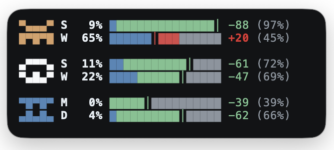

# model-usage-hud

Unified terminal HUD for monitoring usage across:
- Claude Code subscription windows (5h, 7d, 7d-opus)
- OpenAI Codex local rate-limit snapshots from `~/.codex/sessions/*.jsonl`
- Gemini local request + token usage from `~/.gemini/tmp/*/chats/session-*.json`



## Quick Start

Install as a global command from the repo root:

```bash
python3 -m pip install -e .
```

Then run anywhere:

```bash
usage-hud
```

Or run directly without installing:

```bash
cd ~/Code/model-usage-hud
./usage-hud
```

See `docs/SETUP.md` for provider configuration and `docs/PRIVACY.md` for safe-commit guidance.

## Features

- Single command: `usage-hud` — defaults to `--mini --force`
- Compact two-line provider badges (Claude, OpenAI, Gemini)
- Pace bars with expected-usage marker showing delta and target
- macOS default: always-on-top frameless PiP-style window
- Filter providers with `--providers claude,codex,gemini`
- Codex uses local session logs (no OpenAI API key required)
- Gemini mini bars with configurable request limits (defaults: `120/min`, `1500/day`)
- JSON output mode for scripting

## Usage Examples

Run one snapshot in the terminal:

```bash
usage-hud --once --no-always-on-top
```

Show all Codex buckets:

```bash
usage-hud --once --all-limits --no-always-on-top
```

Always-on-top with title bar / smaller text / custom geometry:

```bash
usage-hud --always-on-top-framed
usage-hud --always-on-top-font-size 7
usage-hud --always-on-top-geometry 320x130+40+40
```

Single provider, monochrome, or JSON:

```bash
usage-hud --providers codex
usage-hud --no-color
usage-hud --json --once
```

## Reading the Display

Each window line shows:
- `%` actual utilization
- bar with a vertical marker `│` for expected utilization at this point in the window
- signed delta (`+/-`) versus expected pace
- target utilization in parentheses (for example `(43%)`)

Window labels:
- Claude/Codex: `S` = short window, `W` = week window
- Gemini: `M` = minute request window, `D` = daily request window

Interpretation:
- red delta: spending faster than steady pace
- green delta: spending slower than steady pace
- marker near actual fill: on pace

## All Options

```bash
usage-hud --help
```

Notable options:
- `--mini` compact view
- `--force` replace existing HUD lock
- `--interval 15` refresh every 15 seconds
- `--no-alt-screen` keep scrollback
- `--all-limits` show all Codex limit buckets
- `--providers codex,gemini` show only selected providers (`claude`, `codex`, `gemini`; default: all)
- `--always-on-top` force topmost HUD window
- `--no-always-on-top` force terminal rendering
- `--always-on-top-font-size 7` smaller/larger text size in topmost mode (default: 7.5)
- `--always-on-top-geometry 320x130+40+40` set initial topmost window size/position (default: `320x130+40+40`)
- `--always-on-top-frameless` hide title bar in topmost mode (default on macOS)
- `--always-on-top-framed` show title bar in topmost mode
- `--bar-style solid|legacy|auto` choose bar glyph style (default `auto`: solid in topmost, legacy in terminal)
- `--codex-sessions-dir /path/to/sessions`
- `--gemini-tmp-dir /path/to/.gemini/tmp`
- `--gemini-minute-limit-requests 120`
- `--gemini-day-limit-requests 1500`
- `--no-color`

## Notes & Troubleshooting

- Claude usage is fetched from Anthropic OAuth usage API using your macOS Keychain `Claude Code-credentials` item.
- If Claude credentials are missing, the HUD still shows Codex data.
- Gemini request usage is estimated from local Gemini CLI session logs by counting Gemini responses as requests and comparing against request limits.
- Gemini token totals are still included in `--json` output for reference (`minute.used_tokens`, `day.used_tokens`, and per-model totals).
- Gemini defaults (`120/min`, `1500/day`) match Google AI Pro quotas as of February 21, 2026; override with `--gemini-minute-limit-requests` and `--gemini-day-limit-requests` if your account limits differ.
- Lock file default is `~/.usage-hud/usage-hud.lock`; if unavailable, it falls back to `/tmp/usage-hud.lock`.
- On macOS, topmost mode is enabled by default; use `--no-always-on-top` for terminal mode.
- `--always-on-top` is only supported on macOS and cannot be combined with `--json` or `--once`.
- If `--always-on-top` fails with `No module named '_tkinter'`, install Tk for your Python version (for example `brew install python-tk@3.14`) and start a new shell.
- Topmost mode preserves HUD color cues by default; use `--no-color` for monochrome.
- In `--always-on-top-frameless` mode, drag anywhere in the HUD to move it and use `Esc`, `Cmd+W`, or `q` to close.
