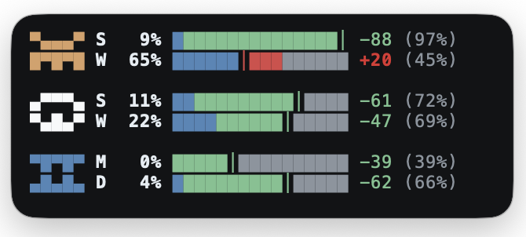
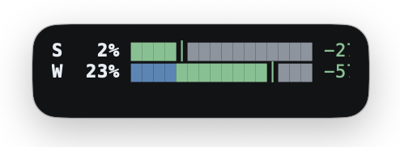

# model-usage-hud

<p align="left">
  
  
</p>

Unified HUD for monitoring usage and tracking progress toward limits across all of the following models:
- Claude Code
- OpenAI Codex
- Gemini

Plus a **System** provider that gauges the local machine (CPU, memory, memory
pressure, swap, disk) so you can see at a glance when a box you use as a server
is redlining or running low on space, monitor it over your tailnet, and let
dependent tools query available headroom. See
[System monitoring](#system-monitoring--tailnet-server).

HUD stays on top of the screen at all times unless explicitly disabled.  Fewer models (e.g. only Claude Code) can be selected as well.
When running a single provider (for example `--providers codex`), the topmost HUD automatically scales down to fit the reduced line count (shown above).


## Quick Start

Install as a global command from the repo root:

```bash
# Use a Python 3.10+ interpreter.
python -m pip install -e .
```

Then run anywhere:

```bash
usage-hud
```

Or run directly without installing:

```bash
cd ~/Code/model-usage-hud
./usage-hud
```

See `docs/SETUP.md` for provider configuration and `docs/PRIVACY.md` for safe-commit guidance.

## Current Status

As of April 9, 2026, the repo is mid-migration from a single-file CLI/Tk HUD to
a same-repo multi-entrypoint project.

- `usage-hud` remains the primary, working entrypoint for the existing CLI/Tk HUD.
- Shared provider view models now exist so the CLI and future app can consume the
  same normalized data instead of duplicating render logic.
- `usage-hud-app` now exists as an experimental PySide6 frontend entrypoint.
- PySide6 is optional and is not required for the CLI path.

If you want to continue app work later, start with:

- [`SPEC.md`](SPEC.md) for the current migration plan and constraints
- `model_usage_hud/core/` for shared models/builders
- `model_usage_hud/app/` for the minimal app scaffold

Current app status:

- The minimal app window fetches and renders the shared provider sections.
- It includes collapsible provider sections, Claude/Codex mute buttons, and
  persisted collapse/window-position state.
- It is still intentionally narrow and does not yet include packaging or a
  polished widget set.
- Install Qt only if you want to work on the app path:

```bash
python -m pip install -e '.[gui]'
usage-hud-app
```

For a repo-local environment:

```bash
python -m venv .venv
.venv/bin/python -m pip install -e '.[gui]'
.venv/bin/usage-hud-app
```

Recommended next step:

- refine the `usage-hud-app` widget layout and then add macOS app packaging,
  keeping `usage-hud` unchanged

## Features

- Single command: `usage-hud` — defaults to `--mini --force`
- Compact two-line provider badges (Claude, OpenAI, Gemini)
- Pace bars with expected-usage marker showing delta and target
- macOS default: always-on-top frameless PiP-style window
- Filter providers with `--providers claude,codex,gemini`
- Topmost window height auto-scales for provider count, including single-provider mode
- Codex uses local session logs (no OpenAI API key required)
- Gemini mini bars with configurable request limits (defaults: `50 P/24h`, `1500 N/24h`)
- Speedometer mode (`--speedometer`): burn-rate (%/h) and ETA-to-throttle on each window line
- JSON output mode for scripting

## Usage Examples

Run one snapshot in the terminal:

```bash
usage-hud --once --no-always-on-top
```

Show all Codex buckets:

```bash
usage-hud --once --all-limits --no-always-on-top
```

Always-on-top with title bar / smaller text / custom geometry:

```bash
usage-hud --always-on-top-framed
usage-hud --always-on-top-font-size 7
usage-hud --always-on-top-geometry 320x130+40+40
```

Speedometer (burn-rate + ETA):

```bash
usage-hud --speedometer
usage-hud --speedometer --interval 10   # faster sampling
```

Single provider, monochrome, or JSON:

```bash
usage-hud --providers codex
usage-hud --no-color
usage-hud --json --once
```

## Reading the Display

Each window line shows:
- `%` actual utilization
- bar with a vertical marker `│` for expected utilization at this point in the window
- signed delta (`+/-`) versus expected pace
- target utilization in parentheses (for example `(43%)`)
- with `--speedometer`: burn rate and ETA suffix (e.g. `⏱ +3%/h ~46h`)

Window labels:
- Claude/Codex: `S` = short window, `W` = week window
- Gemini: `P` = Pro models 24-hour rolling window, `N` = Non-Pro models 24-hour rolling window

Interpretation:
- red delta: spending faster than steady pace
- green delta: spending slower than steady pace
- marker near actual fill: on pace

## All Options

```bash
usage-hud --help
```

Notable options:
- `--mini` compact view
- `--force` replace existing HUD lock
- `--interval 15` refresh every 15 seconds
- `--no-alt-screen` keep scrollback
- `--all-limits` show all Codex limit buckets
- `--providers codex,gemini` show only selected providers (`claude`, `codex`, `gemini`, `system`; default: all)
- `--disk-path /Volumes/Data` filesystem the System provider gauges for free space (default: `/`)
- `--serve` run the tailnet metrics + budget server instead of the HUD (see also `usage-hud-serve`)
- `--serve-host 0.0.0.0` / `--serve-port 8787` bind address/port for `--serve`
- `--always-on-top` force topmost HUD window
- `--no-always-on-top` force terminal rendering
- `--always-on-top-font-size 7` smaller/larger text size in topmost mode (default: 7.5)
- `--always-on-top-geometry 320x130+40+40` set initial topmost window size/position (default: `320x130+40+40`; auto-height scales with `--providers` when unchanged)
- `--always-on-top-frameless` hide title bar in topmost mode (default on macOS)
- `--always-on-top-framed` show title bar in topmost mode
- `--bar-style solid|legacy|auto` choose bar glyph style (default `auto`: solid in topmost, legacy in terminal)
- `--codex-sessions-dir /path/to/sessions`
- `--gemini-tmp-dir /path/to/.gemini/tmp`
- `--gemini-pro-limit-requests 50`
- `--gemini-non-pro-limit-requests 1500`
- `--speedometer` show burn-rate (%/h) and ETA-to-throttle on each window line (auto-widens topmost window to 400px when using default geometry)
- `--no-color`

## System monitoring & tailnet server

The `system` provider turns the HUD into a lightweight machine monitor. It
appears as a fourth section (a green chip icon) with gauge bars for:

- **CPU** — instantaneous busy % (Mach tick delta), with the 1-minute load
  average in the detail column
- **MEM** — memory used % (≈ Activity Monitor's "Memory Used"), with available
  GB and a **memory pressure** note (`warning` / `critical`) driven by the
  kernel's own `kern.memorystatus_vm_pressure_level` — the authoritative
  low-memory signal, which can fire before the used-% bar looks alarming
- **SWP** — swap used % (only shown once swap is actually in use)
- **DSK** — disk used % for `--disk-path` (default `/`), with free GB

Gauges tint green → yellow (≥80%) → red (≥95%) so redlining is obvious in both
the terminal/Tk HUD and the desktop app. No third-party dependencies: metrics
come from `sysctl`, `vm_stat`, the Mach `host_statistics` syscall, and
`shutil.disk_usage`. macOS-only fields degrade to blanks on other platforms.

### Which machine it watches

By default the System provider does **not** report the machine the HUD runs on
(you can already see that in Activity Monitor). It auto-targets a tailnet peer
whose hostname contains `studio` and reads its metrics over the tailnet, so a
laptop HUD shows a headless Mac Studio server. The section footer shows which
box the gauges reflect (e.g. `⌁ stevens-mac-studio`), and reads
`… unreachable: start usage-hud-serve on it` until the server is running there.

This requires [`usage-hud-serve` running on the target](#serve-metrics-over-the-tailnet).

```bash
usage-hud                                  # System auto-targets the tailnet "studio"
usage-hud --system-local                   # read THIS machine instead
usage-hud --system-remote http://host:8787 # point at a specific server
usage-hud --system-name nas                # auto-target a differently-named peer
usage-hud --providers system               # just the machine section
```

Resolution precedence: `--system-local` > `--system-remote URL` >
`USAGE_HUD_SYSTEM_REMOTE` env > auto-detected `--system-name` peer > local.
`--disk-path` / `--json` behave as before and apply to the local read.

### Serve metrics over the tailnet

Run the machine as a monitored server and expose the same data over HTTP:

```bash
usage-hud-serve            # or: usage-hud --serve
```

By default it binds to this machine's **Tailscale IP** (the `100.64.0.0/10`
address), so it is reachable from other tailnet devices and locally, but not
from the public internet or a local LAN. Override with `--host 0.0.0.0` (only
behind a firewall) or `--port` (default `8787`). There is no authentication —
keep it on the tailnet.

Endpoints:

- `GET /` — a self-contained dark web HUD that polls and renders the gauges
- `GET /metrics` — the raw machine snapshot as JSON
- `GET /budget` — advisory headroom for dependent tools
- `GET /healthz` — `{"ok": true}`

To keep it running on a server across reboots, install it as a LaunchAgent
(adjust the path to your checkout / interpreter):

```xml
<!-- ~/Library/LaunchAgents/bio.curie.usage-hud-serve.plist -->
<?xml version="1.0" encoding="UTF-8"?>
<plist version="1.0"><dict>
  <key>Label</key><string>bio.curie.usage-hud-serve</string>
  <key>ProgramArguments</key>
  <array>
    <string>/path/to/model-usage-hud/.venv/bin/usage-hud-serve</string>
  </array>
  <key>RunAtLoad</key><true/>
  <key>KeepAlive</key><true/>
</dict></plist>
```

```bash
launchctl load ~/Library/LaunchAgents/bio.curie.usage-hud-serve.plist
```

### Budget: sizing tools to available headroom

`/budget` is **advisory** — it never reserves or enforces anything. A tool that
depends on the machine asks "how much can I safely take right now?" and decides
for itself:

```bash
curl http://mac-studio.<your-tailnet>.ts.net:8787/budget
```

```jsonc
{
  "cpu":  { "free_pct": 24.4, "free_cores": 2.44 },
  "mem":  { "available_gb": 8.1, "pressure": "normal" },
  "disk": { "free_gb": 262.5, "free_pct": 26.4 },
  "advice": {
    "safe_to_start": false,          // false when CPU is saturated,
    "suggested_mem_gb": 6.1,         // memory pressure is critical, or
    "reason": "cpu busy (98%)"       // disk is nearly full
  }
}
```

A launcher script can gate work on it, e.g. `safe_to_start` before spawning a
local model, and cap its memory at `suggested_mem_gb`.

## Notes & Troubleshooting

- Claude usage is fetched from Anthropic OAuth usage API using your macOS Keychain `Claude Code-credentials` item.
- If Claude credentials are missing, the HUD still shows Codex data.
- Gemini request usage is estimated from local Gemini CLI session logs by counting Gemini responses as requests and comparing against request limits (Pro vs Non-Pro/Flash models).
- Gemini token totals are still included in `--json` output for reference (`pro.used_tokens`, `non_pro.used_tokens`, and per-model totals).
- Gemini defaults (`50/24h P`, `1500/24h N`) match common quotas as of February 27, 2026; override with `--gemini-pro-limit-requests` and `--gemini-non-pro-limit-requests` if your account limits differ.
- Gemini resets are based on a 24-hour rolling window (a request is "returned" to your quota exactly 24 hours after it was made).
- Lock file default is `~/.usage-hud/usage-hud.lock`; if unavailable, it falls back to `/tmp/usage-hud.lock`.
- On macOS, topmost mode is enabled by default; use `--no-always-on-top` for terminal mode.
- `--always-on-top` is only supported on macOS and cannot be combined with `--json` or `--once`.
- If `--always-on-top` fails with `No module named '_tkinter'`, install Tk for your Python version (for example `brew install python-tk@3.14`) and start a new shell.
- Topmost mode preserves HUD color cues by default; use `--no-color` for monochrome.
- In `--always-on-top-frameless` mode, drag anywhere in the HUD to move it and use `Esc`, `Cmd+W`, or `q` to close.
